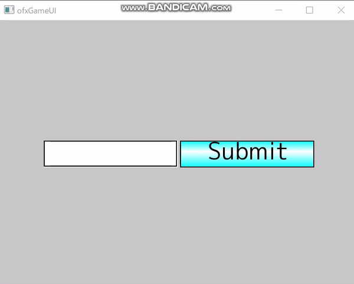
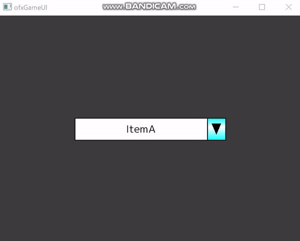
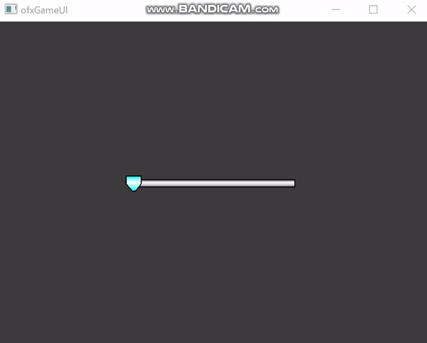

ofxGameUI
=====================================

ofxGameUIはゲーム用のUIを提供します。

Introduction
------------
ofxGameUIはゲーム用のUIを提供します。

Note
------------
フォントは別途インストールする必要があります。  
デフォルトでは、[mplus font](https://mplus-fonts.osdn.jp/about.html)を使用します。

License
-------
MIT License

Installation
------------
このフォルダを `openFrameworks/addons/` に置いてください。

Dependencies
------------
* [ofxIcon](https://github.com/desktopgame/ofxIcon)

Compatibility
------------
* of_v0.10.1_vs2017_release
* Windows10

Known issues
------------
現在のところ、既知の不具合はありません。

Version history
------------

### Version 0.1 (2020/02/14):
最初のリリースです。

### Version 0.2 (2020/02/14):
軽微な修正

### Version 1.1 (2020/02/23):
スライダーに対応
