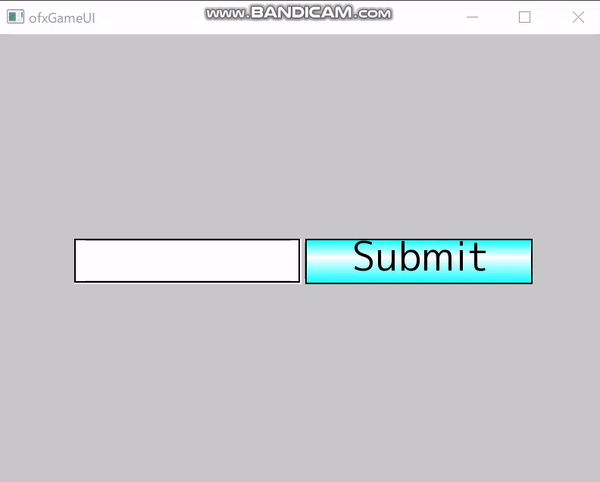

ofxGameUI
=====================================

ofxGameUI is provide ui for game.

Introduction
------------
ofxGameUI is provide ui for game.

Note
------------
font is need a separately install.  
in default, use a [mplus font](https://mplus-fonts.osdn.jp/about.html)

License
-------
MIT License

Installation
------------
this folder into the `openFrameworks/addons/` folder.

Dependencies
------------
* [ofxIcon](https://github.com/desktopgame/ofxIcon)

Compatibility
------------
* of_v0.10.1_vs2017_release
* Windows10

Known issues
------------
known problem is none.

Version history
------------

### Version 0.1 (2020/02/14):
first release.

### Version 0.2 (2020/02/14):
minor fix.

### Version 1.1 (2020/02/23):
added support for slider
